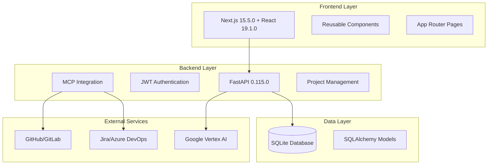

# RampForgeAI Documentation

Welcome to the comprehensive documentation for RampForgeAI, an AI-powered developer onboarding platform that transforms weeks of traditional onboarding into hours of focused learning.

## 📚 Documentation Structure

### Frontend Documentation
- **[Frontend Overview](frontend/README.md)** - Architecture, technology stack, and development guidelines
- **[Components Guide](frontend/components.md)** - Detailed component documentation with usage examples
- **[Pages Documentation](frontend/pages.md)** - Page structure, routing, and implementation patterns

### Backend Documentation
- **[Backend Overview](backend/README.md)** - API architecture, database models, and service layer
- **[API Reference](backend/api.md)** - Complete API endpoint documentation with examples

### Project Information
- **[Changelog](CHANGELOG.md)** - Version history and recent changes
- **[Architecture Overview](#architecture-overview)** - High-level system architecture
- **[Getting Started](#getting-started)** - Quick setup and development guide

## 🏗️ Architecture Overview

RampForgeAI is built as a modern 3-tier web application with clear separation of concerns:



### Technology Stack

#### Frontend
- **Framework**: Next.js 15.5.0 with App Router
- **Language**: TypeScript with strict mode
- **Styling**: Tailwind CSS v4 with custom design system
- **UI Components**: Custom component library with shadcn/ui patterns
- **State Management**: React hooks and context API

#### Backend
- **Framework**: FastAPI 0.115.0
- **Language**: Python 3.11+
- **Database**: SQLAlchemy 2.0.36 with SQLite/aiosqlite
- **Authentication**: JWT with python-jose and bcrypt
- **Testing**: pytest with asyncio support

#### Infrastructure
- **Containerization**: Docker with multi-service compose setup
- **Development**: Hot reload for both frontend and backend
- **API Documentation**: Automatic OpenAPI/Swagger generation

## 🚀 Getting Started

### Prerequisites
- Docker and Docker Compose
- Node.js 18+ (for manual development)
- Python 3.11+ (for manual development)

### Quick Start with Docker (Recommended)
```bash
# Clone the repository
git clone <repository-url>
cd RampForgeAI

# Start all services
docker-compose up --build

# Access the application
# Frontend: http://localhost:3000
# Backend API: http://localhost:8000
# API Docs: http://localhost:8000/api/docs
```

### Manual Development Setup
```bash
# Install all dependencies
npm run install:all

# Start frontend (in one terminal)
cd frontend && npm run dev

# Start backend (in another terminal)
cd backend && python app/main.py
```

### Verify Setup
```bash
# Test connectivity between services
npm run test:connectivity

# Run setup verification
chmod +x test-setup.sh && ./test-setup.sh
```

## 🔧 Development Guidelines

### Code Standards
- **TypeScript**: Strict mode enforced for type safety
- **Python**: Follow PEP 8 with async/await patterns
- **Testing**: Comprehensive unit and integration tests
- **Documentation**: JSDoc for complex components, docstrings for Python

### Component Architecture
All frontend components follow consistent patterns:
1. TypeScript interfaces for props
2. Proper error handling and loading states
3. Accessibility compliance (ARIA attributes)
4. Responsive design with Tailwind CSS

### API Development
Backend endpoints follow RESTful conventions:
1. Proper HTTP status codes
2. Consistent error response format
3. JWT authentication for protected routes
4. Input validation and sanitization

## 🎨 Design System

### Colors
- **Primary**: #6750A4 (deep purple)
- **Accent**: #50A482 (teal)
- **Light**: #F2EFF7 (lavender)

### Typography
- **Headlines**: Space Grotesk
- **Body Text**: Inter
- **Code**: Source Code Pro

### Component Patterns
- Card-based layouts for content organization
- Consistent spacing using Tailwind scale
- Dark/light theme support
- Mobile-first responsive design

## 🔌 Key Features

### Authentication System
- JWT-based authentication with secure token storage
- Role-based access control (admin, developer, team_lead, observer)
- Protected route components for secure pages
- Session management with database tracking

### Code Analysis Engine
- **Repository Management**: Support for GitHub, GitLab, and local repositories
- **Complexity Analysis**: AI-powered complexity scoring with visual indicators
- **Architecture Mapping**: Component identification and dependency visualization
- **Feature Detection**: Automated feature mapping with test coverage analysis
- **Pattern Recognition**: Design pattern identification with confidence scoring
- **Recommendations**: AI-generated improvement suggestions with priority ranking

### MCP Integration
- **Supported Services**: GitHub, GitLab, Jira, Azure DevOps, Confluence
- **Features**: Real-time connection status, health checks, data synchronization
- **Security**: Encrypted credential storage, rate limiting
- **Management**: Web UI for service configuration and monitoring

### Project Management Integration
- **Data Sources**: Jira, Azure DevOps integration
- **Analytics**: Workflow analysis, team insights, performance metrics
- **Visualization**: Project dashboards, team collaboration patterns
- **Intelligence**: AI-powered bottleneck detection and recommendations

### User Interface
- **Layout**: Consistent main layout with sidebar navigation
- **Components**: Reusable UI components following design system
- **Analysis Interface**: Multi-tab analysis results with interactive visualizations
- **Theming**: Light/dark mode support with system preference detection
- **Responsive**: Mobile-friendly design with progressive enhancement

## 📊 API Overview

### Core Endpoints
- **Authentication**: `/api/v1/auth/*` - User management and JWT tokens
- **MCP Services**: `/api/v1/mcp/*` - Service configuration and management
- **Repositories**: `/api/v1/repositories/*` - Repository management and analysis
- **Projects**: `/api/v1/projects/*` - Project data and analysis
- **Health**: `/api/health` - System health monitoring

### Authentication
All protected endpoints require JWT token:
```http
Authorization: Bearer <jwt_token>
```

### Error Handling
Consistent error response format:
```json
{
  "error": true,
  "code": "ERROR_CODE",
  "message": "Human readable message",
  "details": {},
  "timestamp": "2024-01-15T10:30:00Z",
  "request_id": "req_123"
}
```

## 🧪 Testing

### Frontend Testing
- **Unit Tests**: Jest with React Testing Library
- **Component Tests**: Isolated component testing
- **Integration Tests**: User workflow testing
- **E2E Tests**: Playwright for full application testing

### Backend Testing
- **Unit Tests**: pytest for individual functions
- **Integration Tests**: Database and API testing
- **Service Tests**: MCP integration testing
- **Load Tests**: Performance and scalability testing

### Running Tests
```bash
# Frontend tests
cd frontend && npm test

# Backend tests
cd backend && pytest

# E2E tests
npm run test:e2e
```

## 🚢 Deployment

### Development Environment
- Docker Compose with hot reload
- Automatic database initialization
- CORS configured for local development
- Debug logging enabled

### Production Considerations
- Environment-specific configuration
- Database migration to PostgreSQL
- Redis for caching and sessions
- HTTPS and security headers
- Monitoring and logging setup

## 📈 Current Status

### ✅ Completed Features
- Core infrastructure and development environment
- Authentication system with JWT and user management
- MCP client framework with service integrations
- Project management integration with analytics
- Frontend component library and page structure
- Backend API with comprehensive endpoints

### 🔄 In Progress
- Codebase analysis engine with AI integration
- Interactive knowledge assistant with chat interface
- Advanced UI components and navigation

### 📋 Planned Features
- Personalized learning path system
- Legacy knowledge capture and transfer
- Advanced analytics and reporting
- Performance optimization and caching
- Production deployment automation

## 🤝 Contributing

### Development Workflow
1. Follow the established architecture patterns
2. Write tests for new features
3. Update documentation for changes
4. Follow code style guidelines
5. Test integration points thoroughly

### Code Review Process
- All changes require review
- Automated testing must pass
- Documentation must be updated
- Security considerations reviewed

## 📞 Support

### Documentation
- **API Docs**: http://localhost:8000/api/docs (Swagger UI)
- **Component Docs**: See `frontend/components.md`
- **Architecture**: See `backend/README.md`

### Debugging
- **Health Checks**: `/api/health` endpoint
- **Logs**: Docker logs or application logs
- **Database**: SQLite browser for development
- **API Testing**: Use Swagger UI or Postman

### Common Issues
- **Connection Issues**: Check Docker services are running
- **Authentication**: Verify JWT token validity
- **MCP Services**: Check service credentials and connectivity
- **Database**: Ensure database initialization completed

For detailed troubleshooting, see the specific documentation sections for frontend and backend components.