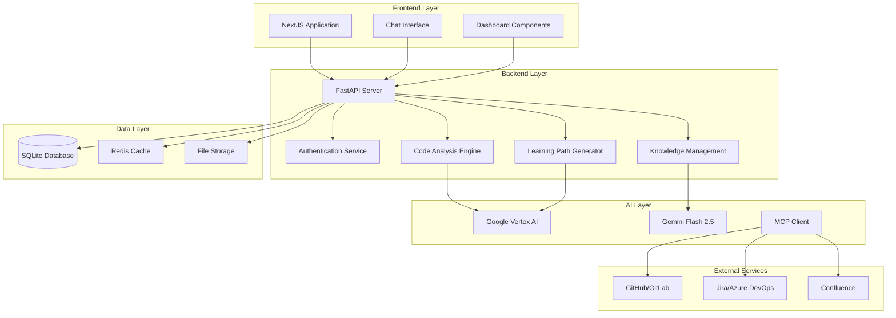
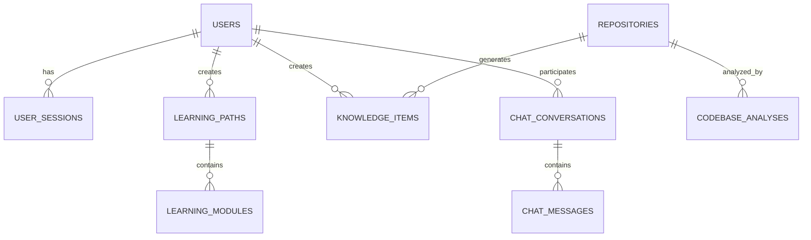

# Design Document

## Overview

RampForgeAI is designed as a modern 3-tier web application that leverages AI and automation to transform developer onboarding. The platform uses a microservices-inspired architecture with clear separation between the presentation layer (NextJS), business logic layer (FastAPI), and data persistence layer (SQLite). The system integrates with external services through the Model Context Protocol (MCP) and utilizes Google Vertex AI for intelligent code analysis and natural language processing.

The architecture prioritizes scalability, maintainability, and real-time responsiveness while ensuring secure handling of sensitive code and project data.

## Architecture

### High-Level Architecture



### Technology Stack Integration

**Frontend (NextJS + TypeScript + Tailwind CSS)**
- Server-side rendering for improved SEO and initial load performance
- TypeScript for type safety and better developer experience
- Tailwind CSS for consistent styling following design guidelines
- Real-time WebSocket connections for chat interface
- Progressive Web App (PWA) capabilities for offline access

**Backend (FastAPI + Python)**
- Asynchronous request handling for improved performance
- Automatic API documentation generation with OpenAPI/Swagger
- Dependency injection for clean architecture and testability
- Background task processing for long-running operations
- WebSocket support for real-time features

**AI Integration (Google Vertex AI + MCP)**
- Vertex AI for code analysis, pattern recognition, and natural language understanding
- Gemini Flash 2.5 for conversational AI and code explanation generation
- MCP client for standardized integration with development tools
- Custom prompt engineering for domain-specific AI responses

## Components and Interfaces

### Frontend Components

#### Core Layout Components
```typescript
interface LayoutProps {
  children: React.ReactNode;
  sidebar?: boolean;
  header?: boolean;
}

interface NavigationItem {
  id: string;
  label: string;
  icon: string;
  path: string;
  badge?: number;
}
```

#### Dashboard Components
```typescript
interface DashboardCard {
  title: string;
  description: string;
  action: string;
  icon: string;
  status: 'available' | 'in-progress' | 'completed';
}

interface ProjectOverview {
  name: string;
  complexity: number;
  lastAnalyzed: Date;
  features: FeatureMap[];
  dependencies: Dependency[];
}
```

#### Chat Interface Components
```typescript
interface ChatMessage {
  id: string;
  content: string;
  type: 'user' | 'assistant' | 'system';
  timestamp: Date;
  attachments?: CodeReference[];
  reactions?: MessageReaction[];
}

interface CodeReference {
  file: string;
  startLine: number;
  endLine: number;
  repository: string;
  content: string;
}
```

### Backend API Interfaces

#### Authentication & User Management
```python
class User(BaseModel):
    id: str
    email: str
    name: str
    role: UserRole
    skills: List[Skill]
    learning_progress: Dict[str, float]
    created_at: datetime
    last_active: datetime

class UserRole(str, Enum):
    ADMIN = "admin"
    DEVELOPER = "developer"
    TEAM_LEAD = "team_lead"
    OBSERVER = "observer"
```

#### Code Analysis Models
```python
class CodebaseAnalysis(BaseModel):
    repository_id: str
    analysis_id: str
    status: AnalysisStatus
    complexity_score: float
    architecture_diagram: str
    feature_map: List[Feature]
    dependencies: List[Dependency]
    patterns: List[CodePattern]
    created_at: datetime
    updated_at: datetime

class Feature(BaseModel):
    name: str
    description: str
    files: List[str]
    complexity: int
    dependencies: List[str]
    tests: List[str]
```

#### Knowledge Management Models
```python
class KnowledgeItem(BaseModel):
    id: str
    title: str
    content: str
    type: KnowledgeType
    source: str
    tags: List[str]
    relevance_score: float
    created_by: str
    created_at: datetime

class LearningPath(BaseModel):
    id: str
    user_id: str
    modules: List[LearningModule]
    progress: float
    estimated_completion: timedelta
    personalization_factors: Dict[str, Any]
```

### MCP Integration Layer

#### MCP Client Configuration
```python
class MCPConfig(BaseModel):
    service_type: str  # github, gitlab, jira, azure_devops
    endpoint: str
    credentials: Dict[str, str]
    enabled: bool
    rate_limits: Dict[str, int]

class MCPClient:
    async def connect_service(self, config: MCPConfig) -> bool
    async def fetch_repository_data(self, repo_url: str) -> RepositoryData
    async def fetch_project_data(self, project_id: str) -> ProjectData
    async def sync_data(self) -> SyncResult
```

## Data Models

### Database Schema

#### Users and Authentication
```sql
CREATE TABLE users (
    id TEXT PRIMARY KEY,
    email TEXT UNIQUE NOT NULL,
    name TEXT NOT NULL,
    role TEXT NOT NULL,
    skills_json TEXT,
    learning_progress_json TEXT,
    created_at TIMESTAMP DEFAULT CURRENT_TIMESTAMP,
    last_active TIMESTAMP
);

CREATE TABLE user_sessions (
    id TEXT PRIMARY KEY,
    user_id TEXT REFERENCES users(id),
    token_hash TEXT NOT NULL,
    expires_at TIMESTAMP NOT NULL,
    created_at TIMESTAMP DEFAULT CURRENT_TIMESTAMP
);
```

#### Code Analysis and Knowledge
```sql
CREATE TABLE repositories (
    id TEXT PRIMARY KEY,
    name TEXT NOT NULL,
    url TEXT NOT NULL,
    type TEXT NOT NULL, -- github, gitlab, local
    last_analyzed TIMESTAMP,
    analysis_status TEXT,
    created_at TIMESTAMP DEFAULT CURRENT_TIMESTAMP
);

CREATE TABLE codebase_analyses (
    id TEXT PRIMARY KEY,
    repository_id TEXT REFERENCES repositories(id),
    complexity_score REAL,
    feature_count INTEGER,
    analysis_data_json TEXT,
    created_at TIMESTAMP DEFAULT CURRENT_TIMESTAMP
);

CREATE TABLE knowledge_items (
    id TEXT PRIMARY KEY,
    title TEXT NOT NULL,
    content TEXT NOT NULL,
    type TEXT NOT NULL,
    source TEXT,
    tags_json TEXT,
    relevance_score REAL,
    created_by TEXT REFERENCES users(id),
    created_at TIMESTAMP DEFAULT CURRENT_TIMESTAMP
);
```

#### Learning and Progress Tracking
```sql
CREATE TABLE learning_paths (
    id TEXT PRIMARY KEY,
    user_id TEXT REFERENCES users(id),
    name TEXT NOT NULL,
    modules_json TEXT,
    progress REAL DEFAULT 0.0,
    estimated_completion INTEGER, -- minutes
    created_at TIMESTAMP DEFAULT CURRENT_TIMESTAMP,
    updated_at TIMESTAMP DEFAULT CURRENT_TIMESTAMP
);

CREATE TABLE chat_conversations (
    id TEXT PRIMARY KEY,
    user_id TEXT REFERENCES users(id),
    title TEXT,
    messages_json TEXT,
    created_at TIMESTAMP DEFAULT CURRENT_TIMESTAMP,
    updated_at TIMESTAMP DEFAULT CURRENT_TIMESTAMP
);
```

### Data Relationships



## Error Handling

### Error Classification and Response Strategy

#### Client Errors (4xx)
```python
class ClientError(Exception):
    def __init__(self, message: str, code: str, details: Dict = None):
        self.message = message
        self.code = code
        self.details = details or {}

# Authentication errors
class AuthenticationError(ClientError): pass
class AuthorizationError(ClientError): pass

# Validation errors
class ValidationError(ClientError): pass
class ResourceNotFoundError(ClientError): pass
```

#### Server Errors (5xx)
```python
class ServerError(Exception):
    def __init__(self, message: str, code: str, context: Dict = None):
        self.message = message
        self.code = code
        self.context = context or {}

# Service errors
class ExternalServiceError(ServerError): pass
class DatabaseError(ServerError): pass
class AIServiceError(ServerError): pass
```

#### Error Response Format
```python
class ErrorResponse(BaseModel):
    error: bool = True
    code: str
    message: str
    details: Optional[Dict] = None
    timestamp: datetime
    request_id: str
```

### Retry and Fallback Strategies

#### MCP Service Integration
- Exponential backoff for rate-limited requests
- Circuit breaker pattern for failing services
- Graceful degradation when external services are unavailable
- Local caching of critical data for offline functionality

#### AI Service Integration
- Fallback to cached responses for common queries
- Progressive timeout handling (5s, 15s, 30s)
- Alternative model selection based on availability
- Queue management for batch processing requests

## Testing Strategy

### Unit Testing
```python
# FastAPI endpoint testing
@pytest.mark.asyncio
async def test_analyze_repository():
    async with AsyncClient(app=app, base_url="http://test") as client:
        response = await client.post(
            "/api/v1/repositories/analyze",
            json={"url": "https://github.com/example/repo"}
        )
        assert response.status_code == 200
        assert "analysis_id" in response.json()

# Component testing with React Testing Library
test('renders dashboard cards correctly', () => {
    render(<Dashboard cards={mockCards} />);
    expect(screen.getByText('Code Analysis')).toBeInTheDocument();
    expect(screen.getByText('Get Started')).toBeInTheDocument();
});
```

### Integration Testing
```python
# MCP integration testing
@pytest.mark.integration
async def test_github_mcp_integration():
    mcp_client = MCPClient()
    config = MCPConfig(
        service_type="github",
        endpoint="https://api.github.com",
        credentials={"token": "test_token"}
    )
    
    result = await mcp_client.fetch_repository_data("owner/repo")
    assert result.status == "success"
    assert len(result.files) > 0

# End-to-end testing with Playwright
test('complete onboarding flow', async ({ page }) => {
    await page.goto('/dashboard');
    await page.click('[data-testid="code-analysis-card"]');
    await page.fill('[data-testid="repo-url"]', 'https://github.com/example/repo');
    await page.click('[data-testid="analyze-button"]');
    
    await expect(page.locator('[data-testid="analysis-progress"]')).toBeVisible();
    await expect(page.locator('[data-testid="analysis-complete"]')).toBeVisible({ timeout: 30000 });
});
```

### Performance Testing
- Load testing for concurrent codebase analysis requests
- Stress testing for chat interface with multiple simultaneous users
- Memory usage monitoring during large repository processing
- Database query optimization validation
- AI service response time benchmarking

### Security Testing
- Authentication and authorization flow validation
- Input sanitization and SQL injection prevention
- API rate limiting effectiveness
- Secure handling of repository credentials and tokens
- Data encryption verification for sensitive information